# 프로젝트명: Legacy Story (Devloper : Photon)

# [ 목차 ]

### 1. [컨셉](#1)
### 2. [관련 이미지와 동영상](#2)
### 3. [대표 이미지](#3)
### 4. [컨셉 & 대표이미지 기반 작품묘사](#4)
### 5. [Legacy Story 구성 요소](#5)
#####  5-1. [메커니즘](#5-1)
#####  5-2. [이야기](#5-2)
#####  5-3. [미적요소](#5-3)
#####  5-4. [기술](#5-4)
### 6. [게임 시스템 디자인](#6)
#####  6-a. [게임 오브젝트 분해 (구성 요소 분석)](#6-1)
#####  6-b. [파라미터(속성) 뽑아 보기](#6-2)
#####  6-c. [행동 뽑아 보기](#6-3)
#####  6-d. [상태 뽑아 보기](#6-4)
#####  6-e. [플레이어 캐릭터 속성(파라미터)](#6-5)
#####  6-f. [게임의 규칙](#6-6)
#####  6-g. [게임에서 사용될 공식](#6-7)
### 7. [직업 특징](#7)
### 8. [요구사항](#8)
### 11. [프로토타입 개발 요구사항](#9)
### 12. [프로토타입 개발작업 일정](#10)

# [컨셉]

## 메인 컨셉 : 분대

- 어떤 임무나 상황을 타개할 전투 단체.

### 서브 컨셉 1 : 영웅

- 어떤 난관을 해칠 때 그 중심에 있는 인물이자 스토리의 핵심 역할. 이들이 있음으로 비로소 스토리가 만들어진다.

### 서브 컨셉 2 : 수집

- 여러 영웅을 얻으면서 생기는 만족감을 느낄 수 있는 콘텐츠. 게임의 모든 것을 담는 것을 도전하는 사람을 위한 콘텐츠다.

### 서브 컨셉 3 : 스토리

- 게임의 시나리오가 어떤 분위기를 내는지, 어떤 상황인지 알려 줄수 있는 매개체이다.

### 서브 컨셉 4 : 대결

- 자신의 분대가 강하다는 것을 증명하기 위한 행동. 플레이어는 적들이나 보스, 그리고 다른 플레이어와 싸우면서 자신의 분대가 강하다는 것을 알 수 있게 된다.

### 서브 컨셉 5 : 운영

- 어떻게 해야 분대를 강하게 만들 수 있는지 플레이어가 탐구할 수 있는 매개체. 이를 통해 플레이어는 분대를 강하게 만들 수 있는 방법을 자연적으로 알 수 있게 된다.

  

# [관련 이미지 & 동영상]

- 이미지  
  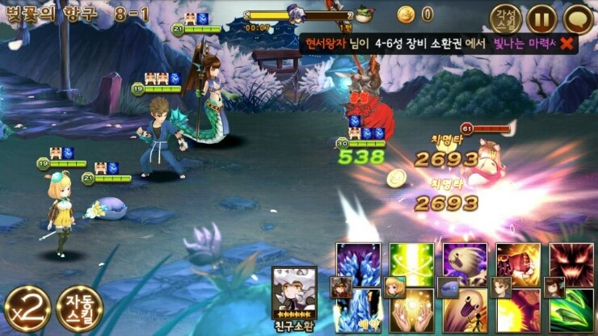
- 동영상
  
  [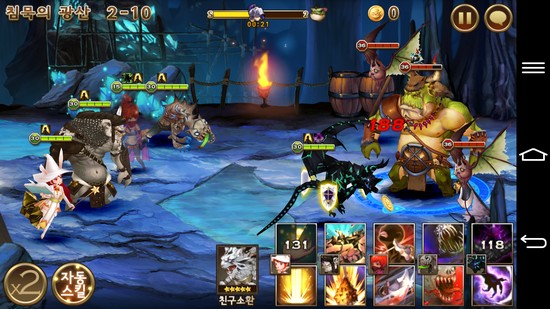](https://www.youtube.com/watch?v=EJuPYJja-us)

  

# [대표 이미지]

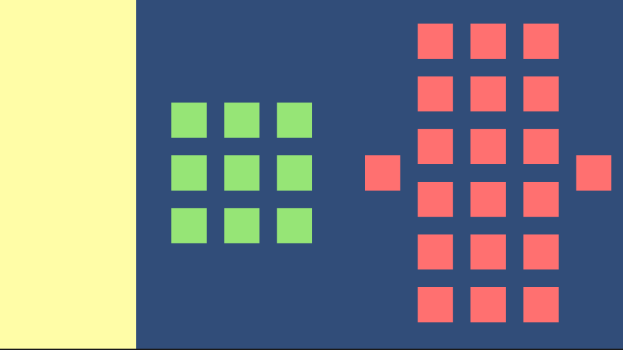

  

# [컨셉 & 대표이미지 기반 작품묘사]

> ### 대표이미지 기반 :
(UI구성) 플레이어가 사용하는 UI는 왼쪽에 표시될 예정입니다.

(화면 좌측) 플레이어가 조작하는 UI가 있습니다. 거기서 각 캐릭터의 체력, 장비, 아이템, 능력, 에너지의 현재 상황을 알 수 있습니다.

(화면 중앙) 화면 중앙에는 플레이어의 캐릭터들이 표시될 예정입니다.

(화면 우측) 적들이 표시될 예정입니다.

(화면 우측 상단) 설정 버튼이 있을 예정입니다.

> ### 컨셉 기반:

(영웅) 플레이어 캐릭터는 화면 중앙에 위치해 있으며, 중앙에서 적들을 공격할 예정입니다.

(대결) 플레이어 캐릭터와 대결할 적들은 모두 우측에 있으며, 우측에서 플레이어 캐릭터를 공격합니다.

(운영) 플레이어는 수동으로 캐릭터들을 좌측 UI에서 조작하여 캐릭터들이 전투에서 승리하게 도와야합니다.

  

# [ Legacy Story 구성 요소]

- Legacy Story

 

## 1. 메커니즘

[도전 과제]

1. 자신의 분대로 스테이지의 모든 적들을 섬멸해야 한다.
2. 모든 스테이지를 클리어해서 스토리를 모두 보는 것이 목표이다.
3. 스테이지에서 모든 분대원들이 쓰러지지 않아야 한다.
4. 강력한 분대를 위해 분대원들을 강화시켜야 한다.

[재미 요소]

1. 다양한 캐릭터를 수집하는 재미가 있다.
2. 거대한 스케일의 세계관을 가진 스토리에 몰두하게 된다.
3. 다른 플레이어와 싸워서 누가 더 강한 분대인지 겨룰 수 있다.
4. 뽑기로 캐릭터를 얻는 것이 아니라, 플레이어가 캐릭터를 성장시켜 각기 다른 직업으로 전직할 수 있다.

 

## 2. 이야기

[만들게 된 배경]  
랜덤 요소인 갓챠 혹은 뽑기로 불리우는 시스템으로 캐릭터를 모집하는 것이 아니라 플레이어가 택하고 성장시킨 캐릭터들을 가지고 분대를 만들어서 싸우는 RPG게임은 없어서
등급도 운 요소도 없는 수집형 RPG게임을 만들어보자는 취지로 만들게 되었다.

[카메라 관점]  
3인칭 시점으로 전장의 현재 모든 상황을 볼 수 있다.

 

## 3. 미적요소

[디자인] 

공통 : 현대, 미래, 중세 판타지 모든 시간대의 물건이나 인물이 나온다.

캐릭터 : 캐릭터는 마법사, 로봇, 전사, 현대 군인 등 다양한 시대별 캐릭터가 등장한다.

아이템 : 플레이어가 소속한 단체가 기술이 발달되고 마법이 공존하는 곳이라는 컨셉이므로 캡슐 같은 SF형식의 아이템과 마법석 같은 판타지에서 나오는 아이템이 있다.

인게임 UI 디자인 : 소속한 단체가 기술이 발달된 단체라는 컨셉이기 때문에 SF 형식의 UI를 사용.

배경화면 디자인 : 현대, 미래, 중세, 아포칼립스 등등 다양한 시대적 배경이 나오기 때문에, 해당 스테이지의 스토리에 따른 배경이 나온다.

[음향]  
기계가 작동되는 소리, 마법을 시전하는 소리, 야수가 울부짖는 소리 등등. 다양한 장르에서 캐릭터들이 나오기 때문에, 많은 종류의 효과음을 사용할 예정.
 

## 4. 기술
2D PC 게임으로 유니티를 사용하여 제작.

# [ 게임 시스템 디자인 ]
## a. 게임 오브젝트 분해

|연번|오브젝트 이름|오브젝트 이미지|
|:----:|:----:|:----:|
|1|버서커(Berserker)/Player||
|2|매직 슈터(Magic Shooter)/Player||
|3|로보틱 센티넬(Robotic Sentinel)/Player||

## b. 파라미터(속성) 뽑아 보기

오브젝트 태그 : Enemy

|속성|영문명칭|설명|
|:----:|:----:|:----:|
|위치|index|현 개체의 위치|
|적의 정보|Enemyinfo|현 개체의 정보|
|공격속도|AttackSpeed|현 개체의 공격속도|
|체력|hitpoint|현 개체의 체력|
|최대 체력|MaxHP|현 개체의 최대 체력|
|공격력|Damage|현 개체의 공격력|
|본래 공격력|BaseDamage|현 개체의 본래 가지고 있던 공격력|
|스킬|Skill|현 개체가 가지고 있는 스킬|
|현재 공격 대상|AttackTarget|현 개체가 공격하고 있는 대상|
|치명타|Critical|현 개체의 치명타 데미지|
|치명타 확률|Critical_Pro|현 개체가 발생할 치명타의 확률|
|출혈|Indication_Blo|현 개체가 출혈 상태인지 판단하는 bool 변수|
|기절|Indication_Stun|현 개체가 기절 상태인지 판단하는 bool 변수|
|도발|Indication_Pro|현 개체가 도발 상태인지 판단하는 bool 변수|
|파괴|Indication_Des|현 개체가 파괴 상태인지 판단하는 bool 변수|
|화상|Indication_Fir|현 개체가 화상 상태인지 판단하는 bool 변수|
|동결|Indication_Fro|현 개체가 동결 상태인지 판단하는 bool 변수|
|전투불능 여부|KnockDown|현 개체가 체력이 0이 되어 전투 불능 상태인지 판단하는 bool 변수|

## c. 행동 뽑아 보기

1) 오브젝트 태그 : Player

|행동|영문명칭|설명|
|:----:|:----:|:----:|
|공격|PlayerAttack|공격 쿨다운이 지나면 타겟을 공격한다.|
|능력 사용|PlayerAbility|조건에 맞는 상황일 경우 또는 플레이어의 조작으로 능력을 사용한다.|
|아이템 사용|ItemUse|조건에 맞는 상황일 경우 또는 플레이어의 조작으로 아이템을 사용한다.|
|공격 타겟 변경|PlayerAttackTarget|타겟이 전투 불능이 되었거나 플레이어의 조작으로 공격 타겟을 변경한다.|
|전투 불능|KnockDown|체력이 0 이하가 되었을 경우, 전투 불능 상태로 변한다.|

2) 오브젝트 태그 : Enemy

|행동|영문명칭|설명|
|:----:|:----:|:----:|
|공격|PlayerAttack|공격 쿨다운이 지나면 타겟을 공격한다.|
|능력 사용|PlayerAbility|조건에 맞는 상황일 경우 능력을 사용한다.|
|공격 타겟 변경|PlayerAttackTarget|타겟이 전투 불능이 되었을 경우 공격 타겟을 변경한다.|
|전투 불능|KnockDown|체력이 0 이하가 되었을 경우, 전투 불능 상태로 변한다.|

## d. 상태 뽑아 보기

1) 오브젝트 태그 : Player

|현 상태|전이 상태|전이 조건|
|:----:|:----:|:----:|
|Process( 진행 상태 )|Process( 진행 상태 )|아무 행동도 취하지 않은 상태|
|Process( 진행 상태 )|공격 상태|공격 타겟이 정해진 경우|
|공격 상태|타겟 변경|공격하던 타겟이 전투 불능이 되었거나 플레이어가 조작한 경우|
|공격 상태|능력 사용|해당 능력 조건에 맞거나 플레이어가 조작한 경우|
|공격 상태|아이템 사용|해당 능력 조건에 맞거나 플레이어가 조작한 경우|
|공격 상태|스턴 상태|해당 개체의 스턴 변수가 true일 경우|
|공격 상태|전투 불능|체력이 0이 된 경우|

2) 오브젝트 태그 : Enemy
   
|현 상태|전이 상태|전이 조건|
|:----:|:----:|:----:|
|Process( 진행 상태 )|Process( 진행 상태 )|아무 행동도 취하지 않은 상태|
|Process( 진행 상태 )|공격 상태|공격 타겟이 정해진 경우|
|공격 상태|타겟 변경|공격하던 타겟이 전투 불능이 되었을 경우|
|공격 상태|능력 사용|해당 능력 조건에 맞는 상황일 경우|
|공격 상태|스턴 상태|해당 개체의 스턴 변수가 true일 경우|
|공격 상태|전투 불능|체력이 0이 된 경우|

## e. 플레이어 캐릭터 속성(파라미터)

|속성|영문명칭|설명|
|:----:|:----:|:----:|
|위치|index|현 개체의 위치|
|레벨|Level|현 개체의 레벨|
|경험치|EXP|현 개체의 경험치|
|직업|Career|현 개체의 직업|
|세부 직업|DetailCareer|현 개체의 세부 직업|
|공격속도|AttackSpeed|현 개체의 공격속도|
|체력|hitpoint|현 개체의 체력|
|최대 체력|MaxHP|현 개체의 최대 체력|
|보호막|Shield|현 개체의 보호막|
|최대 보호막|MaxShield|현 개체의 최대 보호막|
|공격력|Damage|현 개체의 공격력|
|본래 공격력|BaseDamage|현 개체의 본래 가지고 있던 공격력|
|에너지|Mana|현 개체의 에너지|
|최대 에너지|MaxMana|현 개체의 최대 에너지|
|스킬|Skill|현 개체가 가지고 있는 스킬|
|장비|equipment|현 개체가 착용하고 있는 장비|
|아이템|item|현 개체가 착용하고 있는 아이템|
|현재 공격 대상|AttackTarget|현 개체가 공격하고 있는 대상|
|치명타|Critical|현 개체의 치명타 데미지|
|치명타 확률|Critical_Pro|현 개체가 발생할 치명타의 확률|
|출혈|Indication_Blo|현 개체가 출혈 상태인지 판단하는 bool 변수|
|기절|Indication_Stun|현 개체가 기절 상태인지 판단하는 bool 변수|
|도발|Indication_Pro|현 개체가 도발 상태인지 판단하는 bool 변수|
|파괴|Indication_Des|현 개체가 파괴 상태인지 판단하는 bool 변수|
|화상|Indication_Fir|현 개체가 화상 상태인지 판단하는 bool 변수|
|동결|Indication_Fro|현 개체가 동결 상태인지 판단하는 bool 변수|
|전투불능 여부|KnockDown|현 개체가 체력이 0이 되어 전투 불능 상태인지 판단하는 bool 변수|

## f. 게임의 규칙
### 1) 핵심 규칙

승리 조건 :
- 분대원이 한 명이라도 생존했으며, 스테이지의 모든 적을 처치했을 경우

패배 조건 :
 - 스테이지에 적이 남아 있고, 분대원이 모두 전투 불능 상태일 경우

공격 : 공격은 자동적으로 공격 쿨다운이 지나며 공격하며, 타겟을 정할 때 이하의 규칙이 적용된다.
- 앞 라인에 몬스터 혹은 캐릭터가 존재할 경우, 뒷 라인의 적을 타겟으로 삼지 못한다.

### 2) 보조 규칙

  아이템, 장비 : 아이템, 장비는 모두 각 캐릭터 마다 한 개씩 장비를 할 수 있으며, 내구도가 0이면 사용할 수가 없다. 각각 내구도가 닳는 상황은 다음과 같다.
- 아이템 : 게임 중 사용 시 내구도가 닳는다.
- 장비 : 스테이지 시작 시 내구도가 닳는다.

스킬 : 스킬은 아이템과 장비처럼 한 개만 사용할 수 있다. 스킬은 패시브, 액티브로 나뉘어지는데 특징은 다음과 같다.
- 패시브 : 사용할 수 없지만, 영구적으로 발동이 된다.
- 액티브 : 필요 에너지를 소비하여 사용할 수 있다. 패시브보다 효과가 좋으며, 위급한 상황에 역전의 발판을 마련할 수도 있다.

## g. 게임에서 사용될 공식
### 1) 스테이지에 사용되는 공식
 - 만약 플레이어의 분대원이 모두 전투 불능일 경우, 스테이지에서 패배한다.
 - 만약 분대원이 한 명이라도 생존했으며, 스테이지의 모든 적을 처치했을 경우, 스테이지에서 승리한다.

### 2) 분대원, 적 관련 공식
 - 만약 해당 분대원 혹은 적의 체력이 0 이하일 경우 -> 전투 불능 상태로 변경
 - 만약 공격 시 치명타에 당첨되었을 경우 -> 치명타 데미지 발생
 - 만약 해당 객체가 보호막을 가졌을 경우 -> 보호막부터 깎이게 변경
 - 만약 해당 객체가 에너지를 보유했을 경우 -> 일정 시간마다 에너지가 1이 차오른다.
 - 만약 공격 타겟이 전투 불능이 되었을 경우 -> 조건에 맞는 적을 임의적으로 선택해 타겟으로 삼는다.

# [ 직업 특징 ]
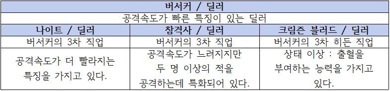
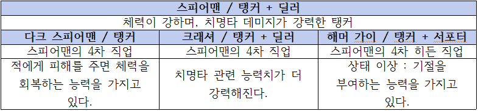
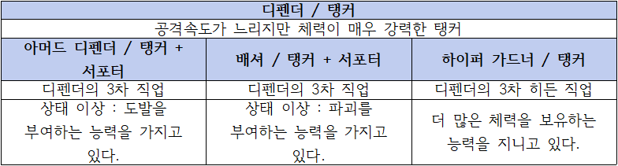
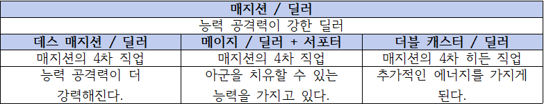
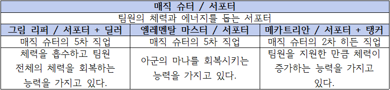
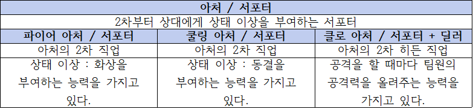
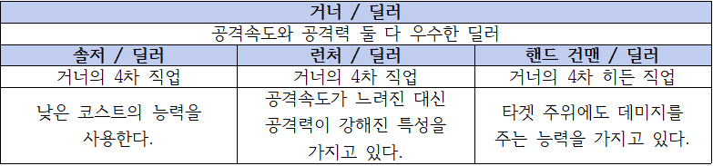
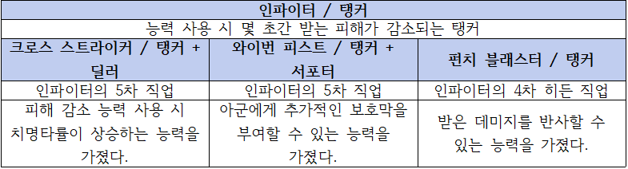
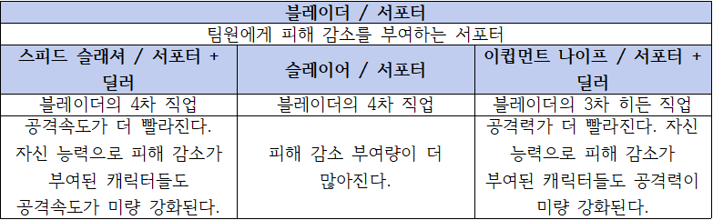

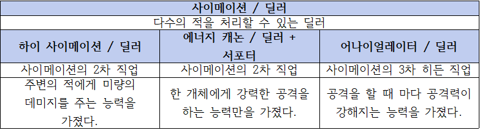
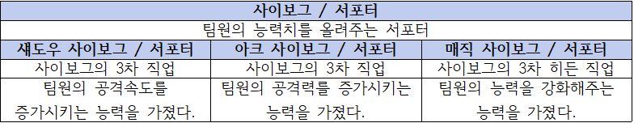

# [ 요구사항 ]

### 홈 관련
- 홈 화면에는 플레이어 레벨, 경험치, 보유 재화량, 각 캐릭터의 정보, 상점, 부대 관리, 사전, 임무 수행, 친구, 설정 버튼이 뜨도록 한다.
- 각 캐릭터 정보에는 캐릭터 이름, 이미지, 현재 레벨이 표시되도록 한다.

### 전투 관련 - 공통
- 딕셔너리로 플레이어의 분대원들을 관리한다.
- 딕셔너리로 적들을 관리한다.
- 플레이어의 캐릭터가 배치되는 곳은 모두 9칸이며, 3x3의 형태를 하고 있다.
- 플레이어의 캐릭터는 최대 5개까지 배치할 수 있다.
- 적이 배치되는 곳은 모두 10칸이며, 1,3x6,1의 형태를 하고 있다.
- 플레이어의 캐릭터는 왼쪽에 배치되며, 적은 오른쪽에 배치된다.
- 플레이어 캐릭터의 체력과 에너지는 모두 각 캐릭터의 UI 아래에서 표시하며, 적의 체력은 각 적 오브젝트의 위에 표시한다.
- 플레이어의 체력은 노란색, 적은 초록색으로 표시한다.
- 각 플레이어 캐릭터의 아래에 에너지가 표시되며, 에너지는 파란색으로 표시된다.
- 해당 객체가 체력이 0이 되면, 전투 불능 상태가 된다.
- 전투 불능 상태가 된 객체는 필드에서 제외된다.
- 각 객체는 타격을 받으면 붉은색으로 점멸하는 효과가 뜬다
- 각 플레이어 캐릭터는 직업에 따라서 스프라이트와 UI의 캐릭터 이미지가 바뀐다.
- 타격을 받거나, 체력 혹은 에너지가 회복되면 그에 맞춰 색이 점멸되고 수치가 뜬다.
- 타겟을 결정해야 하는 경우, 화면 중앙 상단에 타겟을 지정하라는 텍스트가 표시된다. 

### 전투 관련 - 공격
- 각각 코루틴을 사용하여 공격을 하면 공격속도만큼 쿨다운을 설정한다. 이후, 코루틴을 재귀하여 다시 공격하게 한다.
- 공격하던 타겟이 전투 불능 상태가 되었을 경우, 다른 타겟으로 공격을 옮긴다.
- 각 객체는 전투가 시작되자 마자 자동으로 조건에 맞는 임의의 적을 타겟으로 삼는다.
- 공격하던 타겟이 전투 불능 상태가 되었을 경우, 다른 타겟으로 공격을 옮긴다.
- 만약 앞 라인이 적이 있다면, 해당 객체는 뒤 라인을 공격 타겟으로 삼지 못한다.
- 전장에 있는 플레이어 캐릭터를 누르면 수동 공격 타겟 변경이 가능하다.
- 수동 공격 타겟 변경시, 선택된 캐릭터와 타겟 위에 마름모가 뜬다.
- 수동 공격 타겟 변경 상태일 때, 조건에 맞는 적을 선택하면 그 캐릭터의 타겟이 선택한 적으로 바뀐다.
- 보호막이 있으면 슬라이더가 연한 푸른색으로 변하며, 보호막이 체력 옆에 몇인지 표시된다.
- 보호막이 있을 때 피격을 받으면, 체력 대신에 보호막이 먼저 닳는다.

### 전투 관련 - UI
- 왼쪽에 캐릭터들의 정보가 있는 UI를 만든다.
- UI틀은 연한 노란색으로 표시한다.
- UI에 있는 각 캐릭터의 직업을 누르면, 현재 장비, 아이템의 상황, 능력을 볼 수 있다.
- UI에서 각 캐릭터의 아이템을 사용할 수 있다.
- 아이템 사용 시 내구도가 닳는다.
- 스테이지 시작 시 장비의 내구도가 1 이상이면 내구도 하나를 빼고, 그 장비에 맞는 능력치를 장비를 장착한 캐릭터에게 증정된다.
- 각 캐릭터는 1.5초 마다 에너지가 1이 찬다.

### 전투 관련 - 스킬
- 버서커의 스킬 - 블러드 슬래쉬 추가 (공격 타겟에게 150%의 데미지)
- 매직 슈터의 스킬 - 에너지 볼 추가 (가장 마나 비율이 낮은 아군의 마나를 회복시켜준다.)
- 로보틱 센티넬의 스킬 - 보호막 생성 추가 (체력의 10%만큼 보호막이 생성된다.)

### 분대 관리 관련 - 분대원 인벤토리
- 인벤토리 칸은 최대 100칸이다.
- 인벤토리의 한 줄에는 여섯 개의 칸이 존재한다.
- 인벤토리 창은 위 아래로 드래그하여 모두 볼 수 있다.
- 인벤토리의 칸에 표시되는 캐릭터 정보는 캐릭터 이미지, 캐릭터 직업 이름, 캐릭터 레벨이다.
- 인벤토리의 칸에 있는 캐릭터를 드래그 할 수 있다.
- 인벤토리의 캐릭터를 드래그해서 다른 슬롯에 넣을 수 있다.
- 안벤토리의 캐릭터의 정보는 스스로 바뀌게 되어있다.
- 분대 관리에 들어가면 시스템이 카드를 생성해 정해진 곳에 배치한다.
- 인벤토리에 있는 카드를 화면 우측 상단의 분대 설정 칸에 넣으면 그 캐릭터의 이미지로 바뀌며, 플레이어가 지정한 곳에 배치된다.
- 만약 다른 카드나 분대원에 드랍하면 그 분대원 혹은 카드와 선택한 분대원 혹은 카드의 위치가 서로 바뀐다.
- 분대 설정 칸은 최대 9칸이다.
- 분대 설정에 표시되는 캐릭터 정보는 캐릭터 이미지이다.
- 분대 설정에 있는 캐릭터를 드래그 할 수 있다.
- 분대 설정를 드래그해서 다른 슬롯에 넣을 수 있다.
- 분대 설정의 캐릭터의 정보는 스스로 바뀌게 되어있다.
- 지정한 분대는 분대 설정 칸 왼쪽인 좌측 상단에 미리보기로 표시된다.

# [ 프로토타입 개발 요구사항 ]

### 1) 1주 - 홈 디자인, 계획

- ~~홈 화면에는 플레이어 레벨, 경험치, 보유 재화량, 각 캐릭터의 정보, 상점, 부대 관리, 사전, 임무 수행, 친구, 설정 버튼이 뜨도록 한다. (100%)~~
- ~~각 캐릭터 정보에는 캐릭터 이름, 이미지, 현재 레벨이 표시되도록 한다. (100%)~~

### 2) 2주 - 스테이지 배틀 세팅 : 베이스

- ~~딕셔너리로 플레이어의 분대원들을 관리한다. (100%)~~
- ~~딕셔너리로 적들을 관리한다. (100%)~~
- ~~플레이어의 캐릭터가 배치되는 곳은 모두 10칸이며, 2x5의 형태를 하고 있다. (100%)~~
- ~~플레이어의 캐릭터는 최대 9개까지 배치할 수 있다. (100%)~~
- ~~적이 배치되는 곳은 모두 10칸이며, 2x5의 형태를 하고 있다. (100%)~~
- ~~플레이어의 캐릭터는 왼쪽에 배치되며, 적은 오른쪽에 배치된다. (100%)~~

### 3) 3주 - 스테이지 배틀 세팅 : 공격

- ~~각각 코루틴을 사용하여 공격을 하면 공격속도만큼 쿨다운을 설정한다. 이후, 코루틴을 재귀하여 다시 공격하게 한다. (100%)~~
- ~~체력은 모두 각 오브젝트의 위에 표시한다. (100%)~~
- ~~플레이어의 체력은 노란색, 적은 초록색으로 표시한다. (100%)~~
- ~~해당 객체가 체력이 0이 되면, 전투 불능 상태가 된다.(100%)~~
- ~~전투 불능 상태가 된 객체는 필드에서 제외된다. (100%)~~
- ~~공격하던 타겟이 전투 불능 상태가 되었을 경우, 다른 타겟으로 공격을 옮긴다. (100%)~~
- ~~각 객체는 전투가 시작되자 마자 자동으로 조건에 맞는 임의의 적을 타겟으로 삼는다. (100%)~~
- ~~공격하던 타겟이 전투 불능 상태가 되었을 경우, 다른 타겟으로 공격을 옮긴다. (100%)~~
- ~~만약 앞 라인이 적이 있다면, 해당 객체는 뒤 라인을 공격 타겟으로 삼지 못한다. (100%)~~

- ### 4) 4주 - 스테이지 배틀 세팅 : UI, 수동 선택 추가

- ~~왼쪽에 캐릭터들의 정보가 있는 UI를 만든다. (100%)~~
- ~~UI틀은 연한 노란색으로 표시한다. (100%)~~
- ~~UI에 있는 각 캐릭터의 직업을 누르면, 현재 장비, 아이템의 상황, 능력을 볼 수 있다.(100%)~~
- ~~전장에 있는 플레이어 캐릭터를 누르면 수동 공격 타겟 변경이 가능하다. (100%)~~
- ~~수동 공격 타겟 변경 상태일 때, 조건에 맞는 적을 선택하면 그 캐릭터의 타겟이 선택한 적으로 바뀐다. (100%)~~
- ~~수동 공격 타겟 변경시, 선택된 캐릭터는 초록색이 되며, 그 캐릭터가 공격하는 적은 빨간색이 된다. (100%)~~
- ~~각 플레이어 캐릭터의 아래에 에너지가 표시되며, 에너지는 파란색으로 표시된다. (100%)~~

- ### 5) 5주 - 스테이지 배틀 세팅 : 필드 변화

- ~~( 변경점 ) 플레이어의 캐릭터가 배치되는 곳은 모두 9칸이며, 3x3의 형태를 하고 있다. (100%)~~
- ~~( 변경점 ) 적이 배치되는 곳은 모두 10칸이며, 1,3x6,1의 형태를 하고 있다. (100%)~~

- ### 6) 6주 - 스테이지 배틀 세팅 : UI 변화, 효과 변화, 아이템과 장비 추가

- ~~( 변경점 ) 플레이어 캐릭터의 체력과 에너지가 각 캐릭터의 UI 아래에서 뜨도록 변경 (100%)~~
- ~~( 변경점 ) 플레이어의 캐릭터는 최대 5개까지 배치할 수 있다. (100%)~~
- ~~각 객체는 타격을 받으면 붉은색으로 점멸하는 효과가 뜬다. (100%)~~
- ~~UI에서 각 캐릭터의 아이템을 사용할 수 있다. (100%)~~
- ~~아이템 사용 시 내구도가 닳는다. (100%)~~
- ~~스테이지 시작 시 장비의 내구도가 1 이상이면 내구도 하나를 빼고, 그 장비에 맞는 능력치를 장비를 장착한 캐릭터에게 증정된다. (100%)~~
- ~~각 캐릭터는 1.5초 마다 에너지가 1이 찬다. (100%)~~

- ### 7) 7주 - 스테이지 배틀 세팅 : 연출 변경

- ~~( 변경점 ) 수동 공격 타겟 변경 시 색이 변하는 것이 아닌 마름모가 타겟과 캐릭터 위에 뜨도록 변경 (100%)~~
- ~~각 플레이어 캐릭터는 직업에 따라서 스프라이트와 UI의 캐릭터 이미지가 바뀐다. (100%)~~
- ~~타격을 받거나, 체력 혹은 에너지가 회복되면 그에 맞춰 색이 점멸되고 수치가 뜬다. (100%)~~

- ### 8) 8주 - 스테이지 배틀 세팅 : 보호막, 스킬 추가

- ~~보호막이 있으면 슬라이더가 연한 푸른색으로 변하며, 보호막이 체력 옆에 몇인지 표시된다. (100%)~~
- ~~보호막이 있을 때 피격을 받으면, 체력 대신에 보호막이 먼저 닳는다. (100%)~~
- ~~버서커의 스킬 - 블러드 슬래쉬 추가 (공격 타겟에게 150%의 데미지) (100%)~~
- ~~매직 슈터의 스킬 - 에너지 볼 추가 (가장 마나 비율이 낮은 아군의 마나를 회복시켜준다.) (100%)~~
- ~~로보틱 센티넬의 스킬 - 보호막 생성 추가 (체력의 10%만큼 보호막이 생성된다.) (100%)~~
- ~~타겟을 결정해야 하는 경우, 화면 중앙 상단에 타겟을 지정하라는 텍스트가 표시된다. (100%)~~

- ### 9) 9주 - 부대 관리 시스템 제작 : 인벤토리 창 기초 다지기

- ~~인벤토리 칸은 최대 100칸이다. (100%)~~
- ~~인벤토리의 한 줄에는 여섯 개의 칸이 존재한다. (100%)~~
- ~~인벤토리 창은 위 아래로 드래그하여 모두 볼 수 있다. (100%)~~
- ~~인벤토리의 칸에 표시되는 캐릭터 정보는 캐릭터 이미지, 캐릭터 직업 이름, 캐릭터 레벨이다. (100%)~~
- ~~인벤토리의 칸에 있는 캐릭터를 드래그 할 수 있다. (100%)~~
- ~~인벤토리의 캐릭터를 드래그해서 다른 슬롯에 넣을 수 있다. (100%)~~
- ~~안벤토리의 캐릭터의 정보는 스스로 바뀌게 되어있다. (100%)~~
- ~~분대 관리에 들어가면 시스템이 카드를 생성해 정해진 곳에 배치한다. (100%)~~
- ~~인벤토리에 있는 카드를 화면 우측 상단의 분대 설정 칸에 넣으면 그 캐릭터의 이미지로 바뀌며, 플레이어가 지정한 곳에 배치된다. (100%)~~
- ~~만약 다른 카드나 분대원에 드랍하면 그 분대원 혹은 카드와 선택한 분대원 혹은 카드의 위치가 서로 바뀐다. (100%)~~
- ~~분대 설정 칸은 최대 9칸이다. (100%)~~
- ~~분대 설정에 표시되는 캐릭터 정보는 캐릭터 이미지와 레벨이다. (100%)~~
- ~~분대 설정에 있는 캐릭터를 드래그 할 수 있다. (100%)~~
- ~~분대 설정를 드래그해서 다른 슬롯에 넣을 수 있다. (100%)~~
- ~~분대 설정의 캐릭터의 정보는 스스로 바뀌게 되어있다. (100%)~~
- ~~지정한 분대는 분대 설정 칸 왼쪽인 좌측 상단에 미리보기로 표시된다. (100%)~~

- ### 10) 10주 - 부대 관리 시스템 제작 : 분대 설정 및 저장

- ~~지정한 분대를 데이터로 저장하여 스테이지에서 플레이어가 지정한 것 그대로 출력이 된다. (100%)~~
- ~~분대원의 자리를 바꾸거나 추가 및 삭제하면 데이터가 저장이 된다. (100%)~~
- ~~분대원 카드의 자리를 바꾸거나 추가 및 삭제하면 데이터가 저장이 된다. (100%)~~
- 홈에서 플레이어가 정한 분대원의 정보를 확인할 수 있다. 정보는 요구사항에 나온 대로 이름, 이미지, 레벨이다.
- 분대 관리에서 일정 재화를 소비해서 분대원을 강화할 수 있다.

- # [ 프로토타입 개발작업 일정 ]

### [1주차 구현과정]

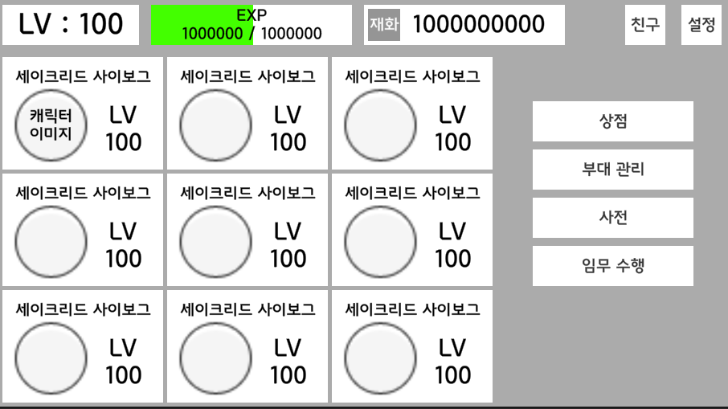

요구사항에 맞춰서 홈을 만들었다.

### [2주차 구현과정]

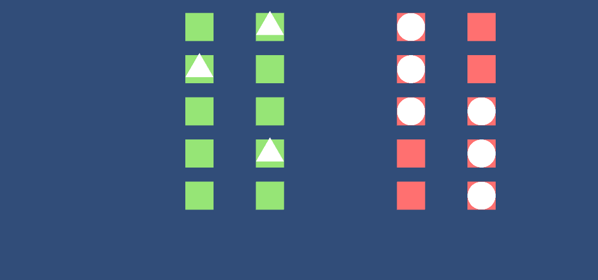

전투를 할 때 쓰이는 전장의 베이스를 만들었다.
플레이어 캐릭터는 왼쪽, 적은 오른쪽에 배치된다.

### [3주차 구현과정]

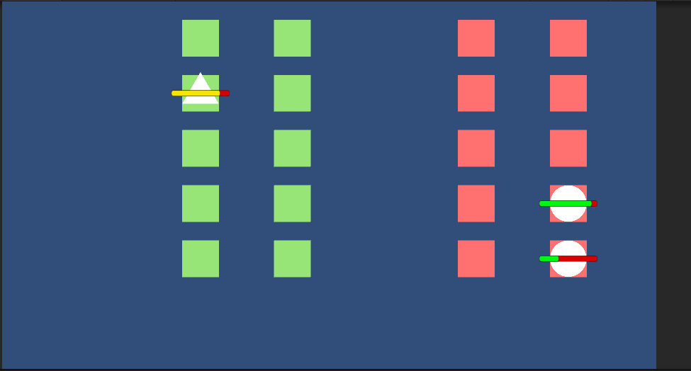

전투가 시작되면, 각 개체는 자동으로 조건에 맞는 적을 공격한다.
각 객체의 체력은 캐릭터 위에 표시되며, 전투 불능이 된 캐릭터는 전장에서 제외된다.

### [4주차 구현과정]

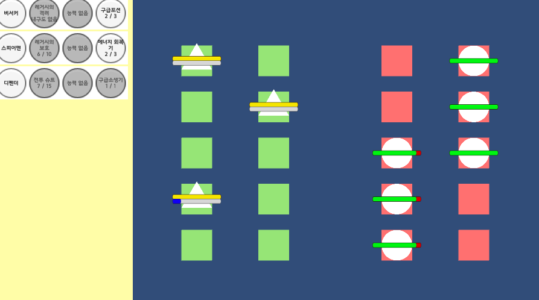

UI가 왼쪽에 출력되며, 그곳에서 캐릭터의 현재 상황을 알 수 있다.
플레이어는 이제 캐릭터를 수동으로 조작해서 다른 적을 공격할 수 있다.

### [5주차 구현과정]

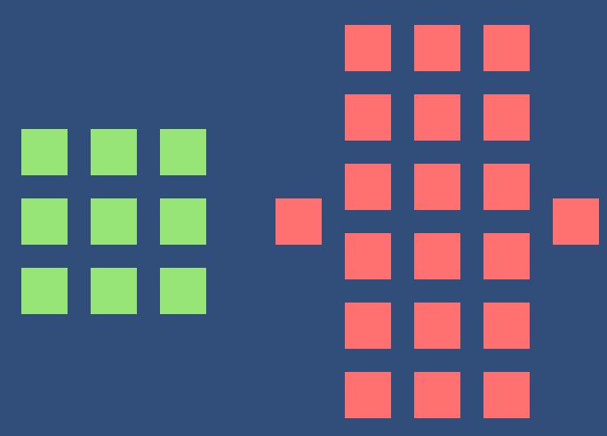

필드의 배치가 완전히 변했다.

### [6주차 구현과정]

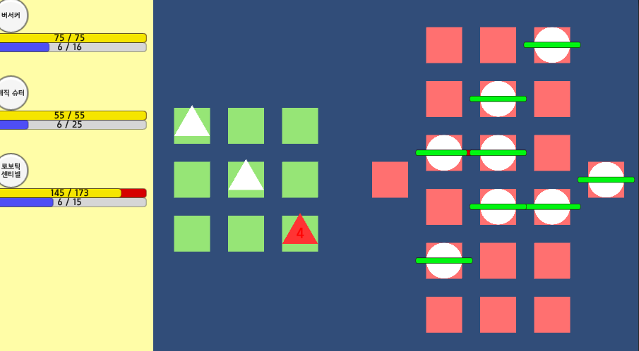

플레이어의 캐릭터가 이제 최대 5까지 가능한 것으로 변경되었다.
직업에 따라서 캐릭터와 UI의 캐릭터 아이콘이 바뀐다.

### [7주차 구현과정]

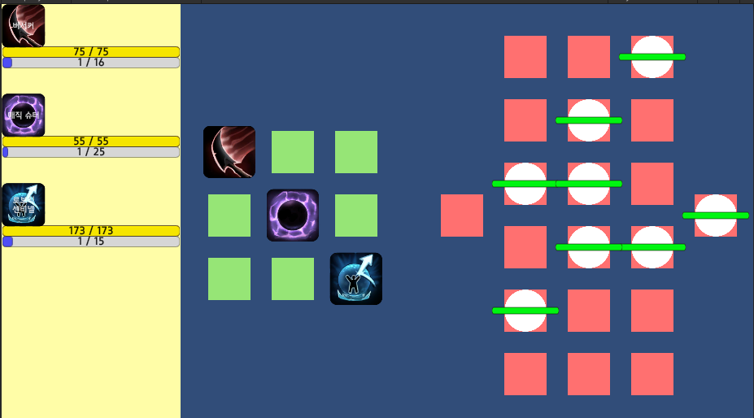

캐릭터 피격 시 연출을 추가했다.

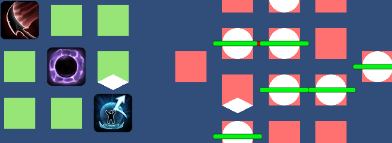

수동 공격 타겟 변경 시 타겟과 선택한 캐릭터 위에 마름모가 뜨게 변경되었다.

### [8주차 구현과정]

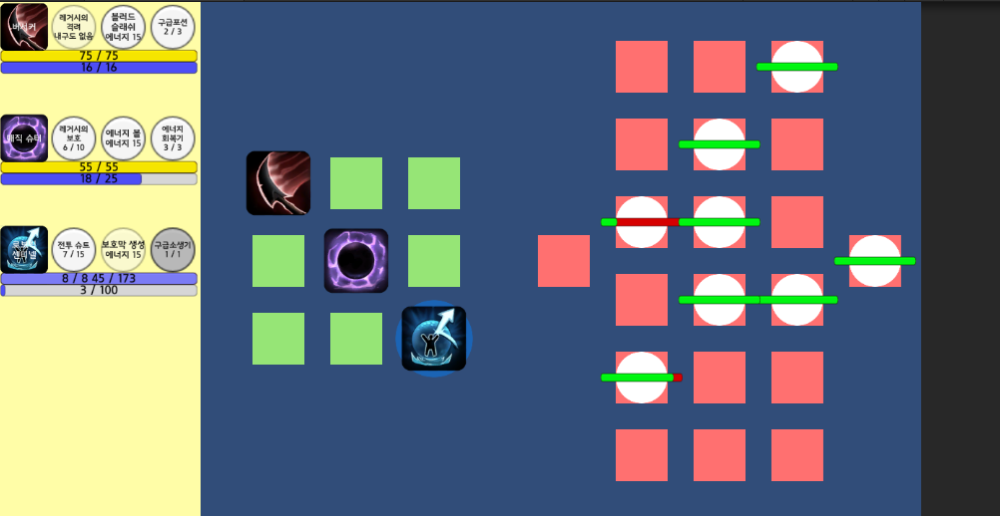

버서커, 매직 슈터, 로보틱 센티넬의 스킬 추가되었다.
보호막이 있을 때 피격을 받으면 체력 대신에 보호막이 먼저 닳는다.

### [9주차 구현과정]

<video width="100%" height="100%" controls="controls">
  <source src="./video/week9-1.mp4" type="video/mp4" />
</video>

캐릭터 카드를 슬롯 창 원하는 곳으로 옮길 수 있다.

<video width="100%" height="100%" controls="controls">
  <source src="./video/week9-2.mp4" type="video/mp4" />
</video>

캐릭터 카드는 주어진 정보를 통해 스스로 이미지, 이름, 레벨을 바꾼다.

<video width="100%" height="100%" controls="controls">
  <source src="./video/week9-3.mp4" type="video/mp4" />
</video>

캐릭터 카드는 서로 위치를 바꿀 수 있다.

<video width="100%" height="100%" controls="controls">
  <source src="./video/week9-4.mp4" type="video/mp4" />
</video>

캐릭터 카드를 스쿼드 슬롯에 넣어서 분대에 배치를 할 수 있으며, 배치된 분대원은 왼쪽에서 미리볼 수 있다.
또한, 스쿼드 슬롯에서도 서로 위치를 바꿀 수 있다.
